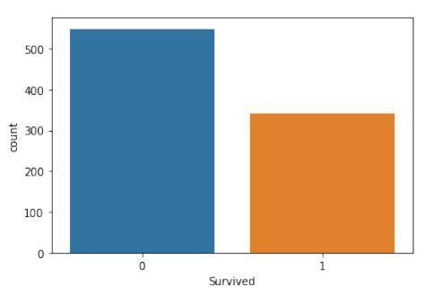
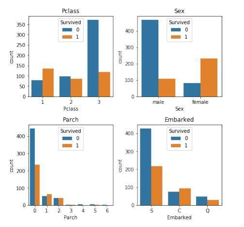
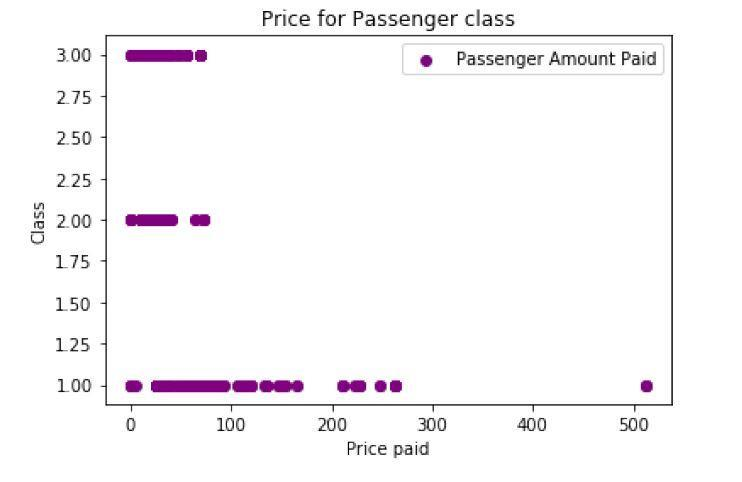
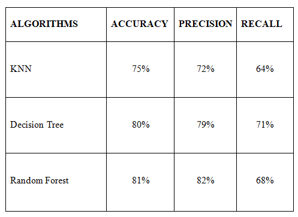
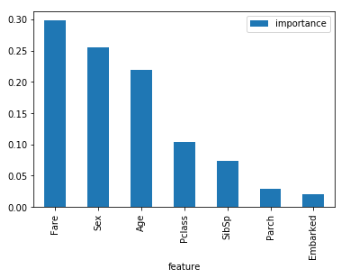
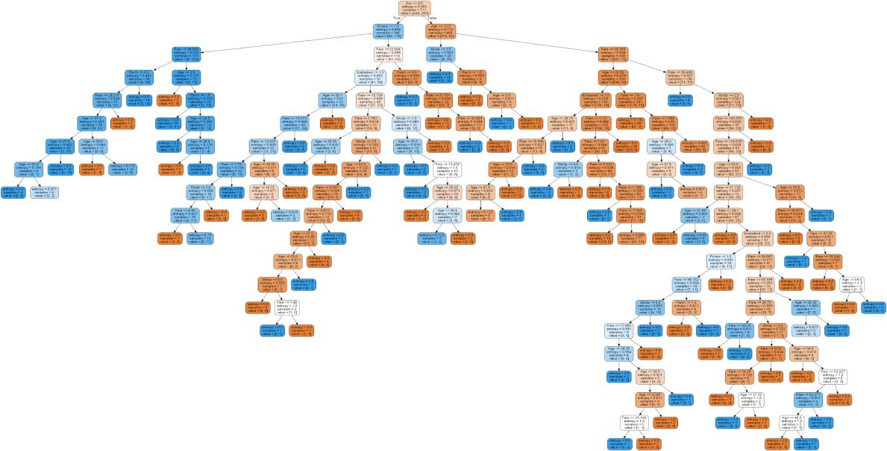
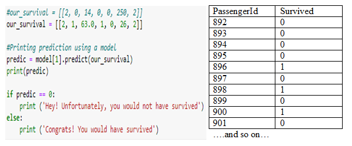

# Titanic Survival — Supervised Machine Learning

Supervised machine-learning classification of Titanic passenger survival using **KNN, Decision Tree, and Random Forest**, with exploratory data analysis, preprocessing, model evaluation, and feature-importance analysis.

## Project Overview

This repository presents a reconstructed portfolio version of a **Data Mining group project completed during WS 2019/2020** in the Master's program at Cologne University of Applied Sciences (TH Köln).

The original project, titled:

**Machine Learning from Disaster — Predicting Survival Rate: Decision Tree Algorithm Approach**

used the Kaggle **Titanic: Machine Learning from Disaster** dataset to investigate passenger-survival patterns and compare supervised machine-learning algorithms.

The original Jupyter notebook is no longer available. The notebook in this repository was reconstructed in 2026 from the surviving code export and final project report.

Selected figures in the `results/` directory were extracted directly from the **original 2020 project report** and are preserved as historical project outputs.

---

## Machine-Learning Workflow

The project demonstrates a classical supervised machine-learning workflow:

- Exploratory data analysis
- Missing-value identification and handling
- Categorical feature encoding
- Feature selection
- Train/test splitting
- k-Nearest Neighbors classification
- Decision Tree classification
- Random Forest classification
- Confusion-matrix evaluation
- Accuracy, precision, and recall comparison
- Decision Tree feature-importance analysis
- Decision Tree visualization
- Example passenger-survival prediction
- Kaggle test-set prediction generation

---

## Dataset

The project uses the Kaggle **Titanic: Machine Learning from Disaster** dataset.

The original training dataset contained **891 passenger records**, while the Kaggle test dataset contained **418 records**.

The prediction target is:

`Survived`

The seven passenger features used in the original classification workflow are:

- `Pclass`
- `Sex`
- `Age`
- `SibSp`
- `Parch`
- `Fare`
- `Embarked`

The raw Kaggle datasets are not redistributed in this repository.

Download:

https://www.kaggle.com/c/titanic

Place the files in:

```text
data/
├── train.csv
└── test.csv
```

See [`data/README.md`](data/README.md) for additional information.

---

## Exploratory Data Analysis

The original project first examined passenger characteristics and their relationship with survival.

### Passenger Survival Distribution



The original dataset contained **549 passengers who did not survive** and **342 passengers who survived**.

---

### Survival Across Passenger Characteristics



The original analysis investigated survival patterns across variables such as passenger class, sex, family relationships, and port of embarkation.

Among the observations documented in the original report:

- approximately **63% of first-class passengers survived**
- approximately **48% of second-class passengers survived**
- approximately **24% of third-class passengers survived**
- approximately **74% of female passengers survived**
- approximately **19% of male passengers survived**

These are descriptive relationships in the historical Titanic dataset and should not be interpreted as causal effects.

---

### Fare and Passenger Class



Fare and passenger class were also examined during the exploratory stage before model development.

---

## Data Preparation

The original workflow prepared the Titanic data for supervised classification by:

1. identifying missing values
2. handling missing `Age` values
3. removing attributes not used for prediction
4. handling missing `Embarked` values
5. encoding categorical variables
6. selecting the seven predictor variables
7. separating the `Survived` target
8. splitting the data into training and testing subsets

The original project used an **80/20 train/test split**.

The reconstructed notebook preserves the overall historical methodology while replacing deprecated Python/Scikit-learn syntax where necessary.

---

## Machine-Learning Models

Three supervised classification algorithms were compared.

### 1. k-Nearest Neighbors

The surviving code export uses:

```python
KNeighborsClassifier(
    n_neighbors=5,
    metric="minkowski",
    p=2
)
```

KNN predicts a passenger's class according to neighboring observations in the feature space.

### 2. Decision Tree

The surviving code uses an entropy-based Decision Tree:

```python
DecisionTreeClassifier(
    criterion="entropy",
    random_state=1
)
```

Decision Tree was especially useful because its decision process and feature importance could be visualized and interpreted.

### 3. Random Forest

The Random Forest implementation uses:

```python
RandomForestClassifier(
    n_estimators=68,
    criterion="entropy",
    random_state=1
)
```

The ensemble combines multiple decision trees to produce the final classification.

---

## Original Model Evaluation

The following figure was extracted directly from the **original 2020 project report**.



### Results Reported in the Final Written Report

| Model | Accuracy | Precision | Recall |
|---|---:|---:|---:|
| KNN | 75% | 72% | 64% |
| Decision Tree | 80% | 79% | 71% |
| Random Forest | **81%** | **82%** | 68% |

Among the three models, **Random Forest achieved the highest reported test accuracy and precision**, while Decision Tree achieved slightly higher recall than Random Forest.

---

## Decision Tree Feature Importance

The original project examined how strongly the selected features contributed to the Decision Tree classifier.



In the surviving code export, the approximate Decision Tree feature-importance values were:

| Feature | Importance |
|---|---:|
| Sex | 0.267 |
| Age | 0.256 |
| Fare | 0.248 |
| Pclass | 0.109 |
| SibSp | 0.047 |
| Parch | 0.044 |
| Embarked | 0.030 |

The strongest features in that saved run were therefore **Sex, Age, Fare, and Passenger Class**.

Feature importance describes the behavior of the fitted model; it should not be interpreted as proof that these variables causally determined survival.

---

## Decision Tree Visualization

The original project also visualized the fitted Decision Tree.



This visualization illustrates how passenger attributes were recursively divided to produce survival classifications.

The reconstructed notebook uses the current Scikit-learn `plot_tree()` functionality rather than the deprecated visualization dependencies present in the historical code.

---

## Example Passenger Prediction and Kaggle Output

The original notebook included a demonstration sometimes described as:

**"Could you have survived the Titanic?"**

A manually specified passenger profile was passed through the trained Decision Tree.



The example used the feature vector corresponding to:

```text
Pclass = 3
Sex = male
Age = 34.5
SibSp = 0
Parch = 0
Fare = 7.8292
Embarked = Q
```

The historical model predicted that this example passenger **did not survive**.

This is included only as an illustration of binary classification and should not be interpreted as a meaningful counterfactual prediction about an actual person's survival.

The original project also applied the trained model to the Kaggle test dataset and generated a submission containing:

```text
PassengerId
Survived
```

---

## Historical Results vs. Reconstructed Notebook

An important distinction is preserved in this repository.

The surviving **written report** and **code-export PDF** contain results from slightly different versions of the experiment.

### Final Report Results

| Model | Accuracy | Precision | Recall |
|---|---:|---:|---:|
| KNN | 75% | 72% | 64% |
| Decision Tree | 80% | 79% | 71% |
| Random Forest | 81% | 82% | 68% |

### Surviving Code-Export Run

| Model | Accuracy | Precision | Recall |
|---|---:|---:|---:|
| KNN | 69.1% | 62.9% | 60.3% |
| Decision Tree | 75.3% | 71.6% | 65.8% |
| Random Forest | 75.8% | 74.2% | 63.0% |

The surviving materials also contain differences in model parameters and random-state choices.

For that reason, these historical values are **not combined or presented as results from a single reproducible experiment**.

The reconstructed notebook calculates its own results when executed, while the original 2020 figures and reported metrics are retained for historical context.

---

## Reconstructed Jupyter Notebook

The portfolio reconstruction is available at:

[`notebooks/Titanic_Survival_Classification_Reconstructed.ipynb`](notebooks/Titanic_Survival_Classification_Reconstructed.ipynb)

The notebook reconstructs the original workflow from the surviving code while updating obsolete syntax where necessary.

It includes:

- data loading
- exploratory analysis
- data cleaning
- categorical encoding
- train/test splitting
- KNN training
- Decision Tree training
- Random Forest training
- accuracy, precision, and recall
- confusion matrices
- model comparison
- feature importance
- Decision Tree visualization
- example passenger prediction
- Kaggle test-set prediction generation

---

## Repository Structure

```text
Titanic-Survival-Supervised-ML/
│
├── README.md
├── requirements.txt
├── .gitignore
│
├── data/
│   └── README.md
│
├── notebooks/
│   ├── README.md
│   └── Titanic_Survival_Classification_Reconstructed.ipynb
│
├── results/
│   ├── README.md
│   ├── 01_survival_distribution.png
│   ├── 02_survival_by_passenger_features.png
│   ├── 03_fare_by_passenger_class.png
│   ├── 04_model_evaluation_table.png
│   ├── 05_feature_importance.png
│   ├── 06_decision_tree_visualization.png
│   └── 07_example_prediction_and_submission.png
│
└── report/
    └── README.md
```

---

## Running the Project

Install the required packages:

```bash
pip install -r requirements.txt
```

Download the Kaggle Titanic `train.csv` and `test.csv` files and place them in the `data/` directory.

Then start Jupyter:

```bash
jupyter notebook
```

Open:

```text
notebooks/Titanic_Survival_Classification_Reconstructed.ipynb
```

---

## Technologies

- Python
- Jupyter Notebook
- Pandas
- NumPy
- Matplotlib
- Seaborn
- Scikit-learn
- Supervised Machine Learning
- Classification
- Exploratory Data Analysis

---

## Original Project and Collaboration

The original project was completed as **Group 5** during the Data Mining course in **WS 2019/2020**.

### Original Group Members

- Gerta Mata
- **Nafiu Ikeoluwa Hammed**
- Onassis Sowah Anyetei

The original report's workload documentation identifies Nafiu Ikeoluwa Hammed's participation in areas including:

- theoretical approach
- data cleansing
- train/test splitting and model fitting
- application and comparison of the machine-learning algorithms
- example real-life prediction scenario
- conclusions

This repository therefore **does not claim sole authorship of the original group project**.

---

## Reconstruction and Archival Note

The original academic project was completed in **February 2020**.

The original `.ipynb` file is no longer available. This repository was reconstructed and curated for portfolio presentation in **2026** using:

- the surviving PDF export of the original Jupyter code and outputs
- the final written group report
- original figures extracted directly from the report

The reconstruction preserves the historical project while modernizing obsolete library syntax where necessary.

The GitHub commits reflect the **2026 archival/reconstruction work** and are not intended to recreate or backdate the original 2020 development history.

---

## Privacy Note

The original final-report PDF is intentionally not included in this public repository because its cover contains the matriculation numbers of all three group members.

The selected figures in `results/` were extracted for presentation without publishing the complete report containing that personal information.

---

## Acknowledgment

This repository preserves an early supervised machine-learning project completed during Master's study and demonstrates the progression from classical classification methods and exploratory data analysis to later work in deep learning, computer vision, and continual learning.
